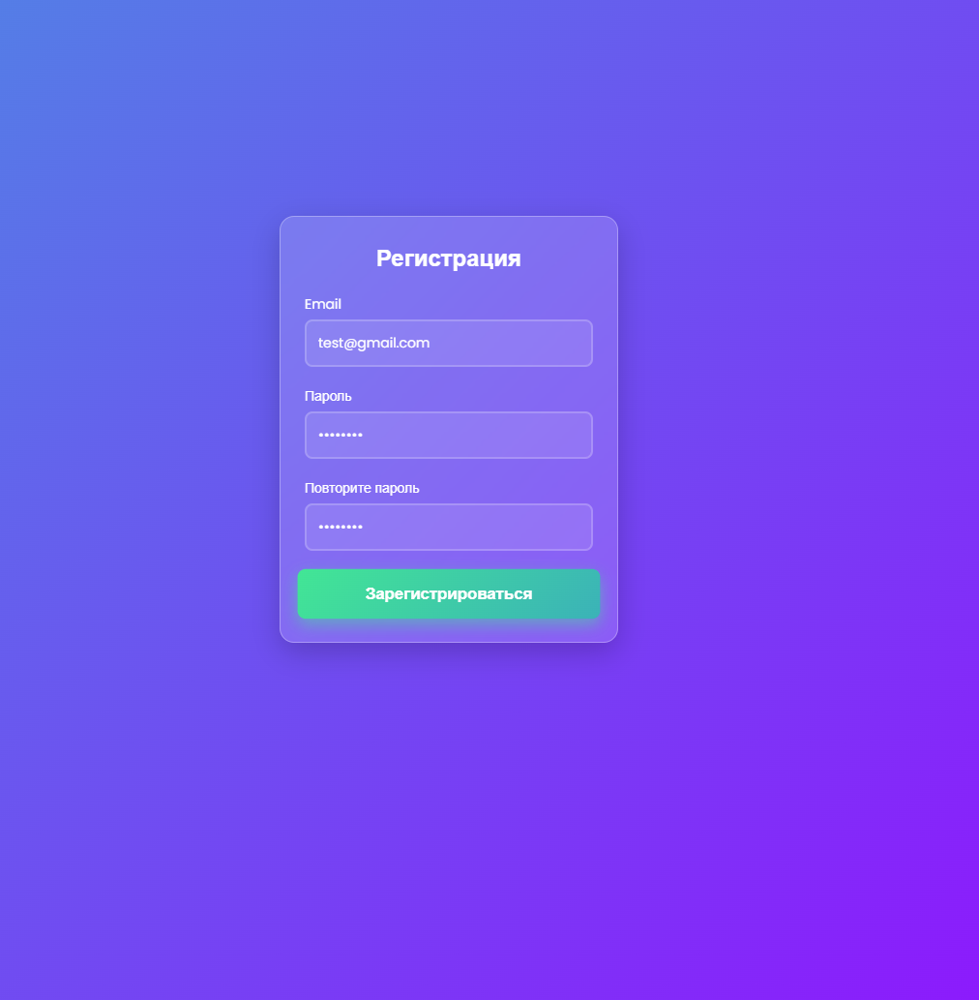
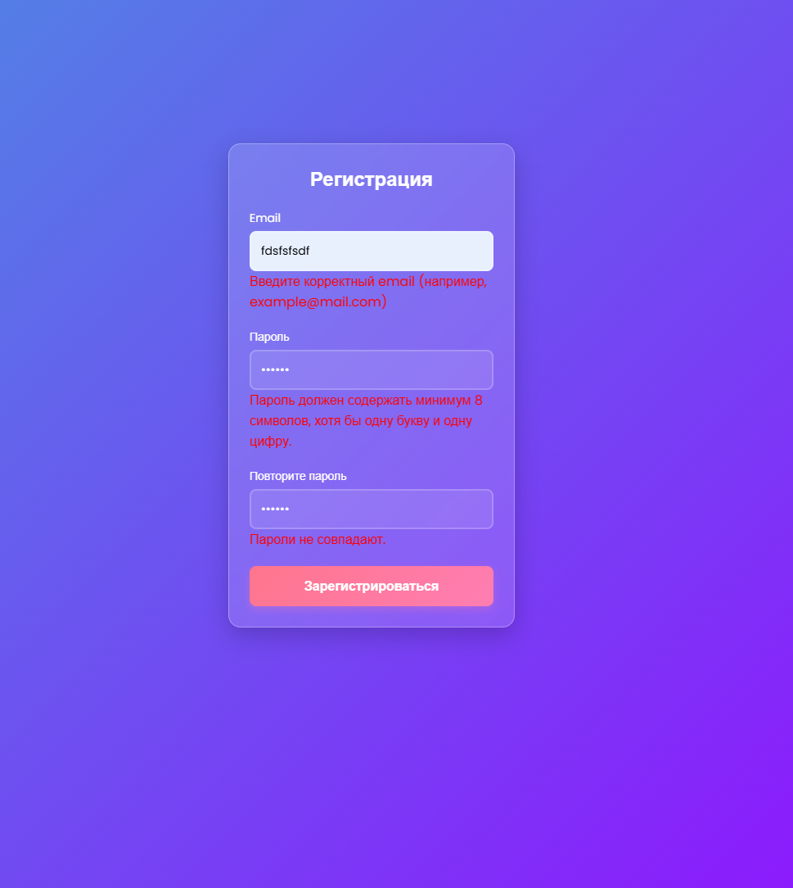

# Страница регистрации

## Пример работы

 



## Описание

*Это интерактивный элемент веб-страницы, предназначенный для сбора информации от посетителей и регистрации их в качестве пользователей. Форма регистрации содержит поля для ввода электронной почты, пароля, необходимых для создания аккаунта или доступа к определенным функциям сайта.*

## Цель

*Реализация собственной валидации полей, а так же реализация через пакет React Hook Form и Yup.*

## Установка:

```sh
$ make setup
```

## Запуск:

```sh
$ make start
```